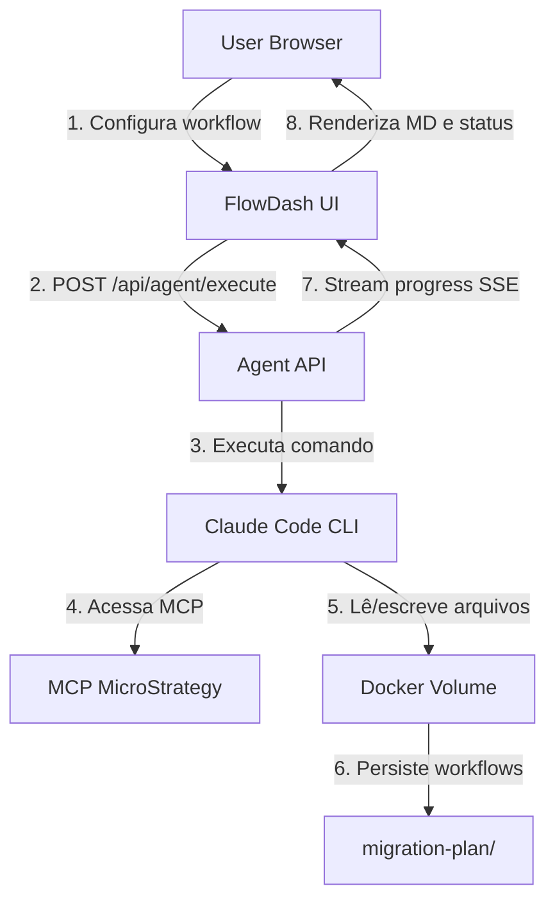

# Plano de Implementação: FlowDash Agent Workflow Extension

## Visão Geral

Criar uma **nova funcionalidade** no FlowDash que adiciona capacidade de execução de agentes Claude de migração MSTR→Power BI via interface web. Esta feature será adicional às funcionalidades existentes do FlowDash (dashboards Neo4j, visualizações, etc), operando como um módulo independente acessível via menu superior.

A extensão permitirá que usuários executem workflows de migração sem precisar de Claude Code local, com interface visual step-by-step para configuração, execução, revisão e aprovação em cada fase do processo de migração.

## Arquitetura Proposta

### Componentes Principais

```
┌─────────────────────────────────────────────────────────────────┐
│                     FlowDash Application                        │
│  ┌─────────────────┐  ┌──────────────────────────────────────┐ │
│  │  Existing       │  │  NEW: Agent Workflow Extension       │ │
│  │  Features       │  │                                      │ │
│  │  - Dashboards   │  │  ┌────────────────────────────────┐  │ │
│  │  - Neo4j Viz    │  │  │  Workflow Wizard (Step 1-5)    │  │ │
│  │  - Reports      │  │  │  - Setup & Configuration       │  │ │
│  │  - Charts       │  │  │  - Data Manager (Scope)        │  │ │
│  │                 │  │  │  - Tech Lead (Analysis)        │  │ │
│  └─────────────────┘  │  │  - Data Engineer (dbt)         │  │ │
│                       │  │  - Data Viz (Semantic)         │  │ │
│                       │  └────────────────────────────────┘  │ │
│                       │                                      │ │
│                       │  ┌────────────────────────────────┐  │ │
│                       │  │  File Explorer & MD Viewer     │  │ │
│                       │  │  - Browse workflow files       │  │ │
│                       │  │  - View/Edit markdown          │  │ │
│                       │  │  - Download artifacts          │  │ │
│                       │  └────────────────────────────────┘  │ │
│                       └──────────────────────────────────────┘ │
└─────────────────────────────────────────────────────────────────┘
                              │
                              ▼
┌─────────────────────────────────────────────────────────────────┐
│                    Agent Execution Engine                        │
│  - Spawns Claude Code CLI processes                             │
│  - Executes /migration:* commands                               │
│  - Streams output to UI (SSE/WebSockets)                        │
│  - Manages workflow state persistence                           │
└─────────────────────────────────────────────────────────────────┘
                              │
                    ┌─────────┴─────────┐
                    │                   │
                    ▼                   ▼
┌─────────────────────────┐  ┌──────────────────────┐
│   Docker Volumes         │  │   MCP HTTP Server   │
│  - Workflows             │  │  (MicroStrategy)    │
│  - Repositories (Git)    │  │                     │
│  - config.json           │  └──────────────────────┘
└─────────────────────────┘
```

### Fluxo de Dados




## Estrutura de Implementação

### 1. Backend - Agent Execution API

**Novo servidor Node.js/Express dentro do FlowDash**

Arquivos a criar:

- `server/agent-api/index.ts` - Servidor Express para API de agentes
- `server/agent-api/routes/agent.ts` - Rotas para execução de agentes
- `server/agent-api/services/ClaudeExecutor.ts` - Service para executar comandos Claude
- `server/agent-api/services/WorkflowManager.ts` - Gerenciamento de workflows
- `server/agent-api/middleware/auth.ts` - Autenticação via Neo4j credentials

**Endpoints principais:**

```typescript
POST   /api/agent/init              // Iniciar novo workflow (Data Manager)
POST   /api/agent/analyse/:workflowId // Análise (Tech Lead)
POST   /api/agent/discover/:workflowId // Discovery dbt (Data Engineer)
POST   /api/agent/apply-dbt/:workflowId // Apply dbt changes
POST   /api/agent/semantic-spec/:workflowId // Semantic spec
POST   /api/agent/semantic-apply/:workflowId // Apply semantic

GET    /api/agent/status/:workflowId  // Status do workflow
GET    /api/agent/workflows           // Listar todos workflows
GET    /api/agent/stream/:executionId // SSE stream de execução

GET    /api/files/browse/:workflowId/:path // Navegar arquivos
GET    /api/files/content/:workflowId/:path // Ler arquivo
PUT    /api/files/content/:workflowId/:path // Atualizar arquivo (MD)
POST   /api/files/approve/:workflowId/:phase/:domain // Marcar aprovação
```

**ClaudeExecutor.ts - Exemplo de implementação:**

```typescript
export class ClaudeExecutor {
  async execute(command: string, args: Record<string, string>): Promise<ExecutionResult> {
    const argsString = Object.entries(args)
      .map(([key, value]) => `${key}="${value}"`)
      .join(' ');
    
    const fullCommand = `claude --command /migration:${command} ${argsString}`;
    
    const execution = spawn('claude', ['--command', `/migration:${command}`, argsString], {
      cwd: '/app/workspace/asos-agentic-workflow',
      env: { ...process.env }
    });
    
    // Stream stdout/stderr para SSE
    execution.stdout.on('data', (data) => {
      this.eventEmitter.emit('output', { executionId, data: data.toString() });
    });
    
    execution.stderr.on('data', (data) => {
      this.eventEmitter.emit('error', { executionId, data: data.toString() });
    });
    
    return { executionId, status: 'running' };
  }
}
```

### 2. Frontend - Workflow Wizard UI

**Nova extensão FlowDash: `agent-workflow**`

Estrutura de arquivos:

- `src/extensions/agent-workflow/AgentWorkflowExtension.tsx` - Configuração da extensão
- `src/extensions/agent-workflow/components/WorkflowWizard.tsx` - Wizard principal
- `src/extensions/agent-workflow/components/steps/Step1Setup.tsx` - Configuração inicial
- `src/extensions/agent-workflow/components/steps/Step2DataManager.tsx` - Data Manager
- `src/extensions/agent-workflow/components/steps/Step3TechLead.tsx` - Tech Lead
- `src/extensions/agent-workflow/components/steps/Step4DataEngineer.tsx` - Data Engineer
- `src/extensions/agent-workflow/components/steps/Step5DataViz.tsx` - Data Viz
- `src/extensions/agent-workflow/components/FileExplorer.tsx` - Navegador de arquivos
- `src/extensions/agent-workflow/components/MarkdownViewer.tsx` - Visualizador MD
- `src/extensions/agent-workflow/components/ApprovalPanel.tsx` - Painel de aprovação
- `src/extensions/agent-workflow/state/workflowReducer.ts` - Redux state
- `src/extensions/agent-workflow/state/workflowActions.ts` - Redux actions
- `src/extensions/agent-workflow/services/AgentService.ts` - Cliente API

**Menu superior - Novo ícone:**

Adicionar botão no menu superior do FlowDash (próximo ao "Settings"):

```tsx
// src/dashboard/header/DashboardHeader.tsx
<IconButton onClick={() => navigate('/agent-workflow')}>
  <AutoAwesomeIcon /> {/* Material UI icon para AI/automation */}
</IconButton>
```

**WorkflowWizard.tsx - Estrutura principal:**

```tsx
export const WorkflowWizard = () => {
  const [activeStep, setActiveStep] = useState(0);
  const [workflowId, setWorkflowId] = useState<string | null>(null);
  
  const steps = [
    { label: 'Setup', component: Step1Setup },
    { label: 'Data Manager', component: Step2DataManager },
    { label: 'Tech Lead', component: Step3TechLead },
    { label: 'Data Engineer', component: Step4DataEngineer },
    { label: 'Data Viz', component: Step5DataViz }
  ];
  
  return (
    <Box sx={{ width: '100%', padding: 4 }}>
      <Stepper activeStep={activeStep}>
        {steps.map((step, index) => (
          <Step key={step.label}>
            <StepLabel>{step.label}</StepLabel>
          </Step>
        ))}
      </Stepper>
      
      <Box sx={{ mt: 4 }}>
        {React.createElement(steps[activeStep].component, {
          workflowId,
          onComplete: () => setActiveStep(activeStep + 1)
        })}
      </Box>
    </Box>
  );
};
```

**Step1Setup.tsx - Configuração inicial:**

```tsx
export const Step1Setup = ({ onComplete }) => {
  const [repos, setRepos] = useState({});
  const [branches, setBranches] = useState({});
  
  const validateRepos = async () => {
    // Valida que repositórios existem no volume
    const result = await AgentService.validateRepos(repos);
    if (result.valid) {
      onComplete();
    }
  };
  
  return (
    <Box>
      <Typography variant="h5">Configuração de Repositórios</Typography>
      <Typography variant="body2" sx={{ mb: 2 }}>
        Confirme os repositórios e branches que os agentes irão trabalhar.
      </Typography>
      
      {Object.keys(repos).map(repoKey => (
        <Card key={repoKey} sx={{ mb: 2 }}>
          <CardContent>
            <Typography variant="h6">{repoKey}</Typography>
            <TextField
              label="Path"
              value={repos[repoKey].path}
              disabled
              fullWidth
            />
            <TextField
              label="Branch"
              value={branches[repoKey] || 'main'}
              onChange={(e) => setBranches({...branches, [repoKey]: e.target.value})}
              fullWidth
              sx={{ mt: 1 }}
            />
          </CardContent>
        </Card>
      ))}
      
      <Button variant="contained" onClick={validateRepos}>
        Validar e Continuar
      </Button>
    </Box>
  );
};
```

**Step2DataManager.tsx - Data Manager Agent:**

```tsx
export const Step2DataManager = ({ workflowId, onComplete }) => {
  const [items, setItems] = useState('');
  const [executing, setExecuting] = useState(false);
  const [output, setOutput] = useState('');
  const [domains, setDomains] = useState<string[]>([]);
  
  const executeInit = async () => {
    setExecuting(true);
    
    // POST /api/agent/init
    const response = await AgentService.initWorkflow(items);
    const { executionId, workflowId: newWorkflowId } = response;
    
    // Escutar SSE stream
    const eventSource = new EventSource(`/api/agent/stream/${executionId}`);
    eventSource.onmessage = (event) => {
      const data = JSON.parse(event.data);
      setOutput(prev => prev + data.output);
      
      if (data.status === 'completed') {
        setExecuting(false);
        setDomains(data.domains); // Extrair domínios criados
        eventSource.close();
      }
    };
  };
  
  return (
    <Box>
      <Typography variant="h5">Data Manager - Scope Review</Typography>
      
      <TextField
        label="Métricas e Atributos"
        placeholder="GUID1, GUID2, Metric Name, Attribute Name"
        multiline
        rows={6}
        value={items}
        onChange={(e) => setItems(e.target.value)}
        fullWidth
        sx={{ mb: 2 }}
      />
      
      <Button 
        variant="contained" 
        onClick={executeInit}
        disabled={executing || !items.trim()}
      >
        {executing ? 'Executando...' : 'Executar Data Manager Agent'}
      </Button>
      
      {executing && <LinearProgress sx={{ mt: 2 }} />}
      
      {output && (
        <Box sx={{ mt: 2 }}>
          <Typography variant="h6">Output:</Typography>
          <Paper sx={{ p: 2, bgcolor: '#1e1e1e', color: '#fff', fontFamily: 'monospace' }}>
            <pre>{output}</pre>
          </Paper>
        </Box>
      )}
      
      {domains.length > 0 && (
        <Box sx={{ mt: 4 }}>
          <Typography variant="h6">Domínios Identificados:</Typography>
          <ApprovalPanel
            workflowId={workflowId}
            phase="01-scope"
            domains={domains}
            onAllApproved={onComplete}
          />
        </Box>
      )}
    </Box>
  );
};
```

**ApprovalPanel.tsx - Painel de aprovação:**

```tsx
export const ApprovalPanel = ({ workflowId, phase, domains, onAllApproved }) => {
  const [approvals, setApprovals] = useState<Record<string, boolean>>({});
  const [selectedDomain, setSelectedDomain] = useState<string | null>(null);
  const [fileContent, setFileContent] = useState('');
  
  const loadDomainFile = async (domain: string) => {
    setSelectedDomain(domain);
    const content = await AgentService.getFileContent(workflowId, `${phase}/${domain}/scope-review.md`);
    setFileContent(content);
  };
  
  const approveCheckbox = async (domain: string) => {
    // Marca checkbox [x] APPROVED FOR NEXT PHASE no MD
    await AgentService.approvePhase(workflowId, phase, domain);
    setApprovals({...approvals, [domain]: true});
    
    if (Object.values({...approvals, [domain]: true}).every(v => v)) {
      onAllApproved();
    }
  };
  
  return (
    <Box sx={{ display: 'flex', gap: 2 }}>
      <Box sx={{ width: '30%' }}>
        <List>
          {domains.map(domain => (
            <ListItem key={domain} button onClick={() => loadDomainFile(domain)}>
              <ListItemIcon>
                <Checkbox
                  checked={approvals[domain] || false}
                  onChange={() => approveCheckbox(domain)}
                />
              </ListItemIcon>
              <ListItemText primary={domain} />
            </ListItem>
          ))}
        </List>
        
        {Object.values(approvals).every(v => v) && (
          <Button variant="contained" color="success" onClick={onAllApproved}>
            Avançar para Próxima Fase
          </Button>
        )}
      </Box>
      
      <Box sx={{ flex: 1 }}>
        {selectedDomain && (
          <>
            <Typography variant="h6">{selectedDomain} - Review</Typography>
            <MarkdownViewer
              content={fileContent}
              editable
              onSave={(newContent) => AgentService.updateFileContent(workflowId, `${phase}/${selectedDomain}/scope-review.md`, newContent)}
            />
            <Button
              variant="outlined"
              startIcon={<DownloadIcon />}
              onClick={() => downloadFile(fileContent, `${selectedDomain}-scope-review.md`)}
            >
              Download
            </Button>
          </>
        )}
      </Box>
    </Box>
  );
};
```

**MarkdownViewer.tsx - Visualizador/editor MD:**

```tsx
export const MarkdownViewer = ({ content, editable, onSave }) => {
  const [editing, setEditing] = useState(false);
  const [editContent, setEditContent] = useState(content);
  
  return (
    <Box>
      {!editing ? (
        <>
          <Box sx={{ border: '1px solid #ccc', p: 2, mb: 2, maxHeight: '600px', overflow: 'auto' }}>
            <ReactMarkdown remarkPlugins={[remarkGfm]}>
              {content}
            </ReactMarkdown>
          </Box>
          {editable && (
            <Button variant="outlined" onClick={() => setEditing(true)}>
              Editar Markdown
            </Button>
          )}
        </>
      ) : (
        <>
          <TextField
            multiline
            rows={20}
            value={editContent}
            onChange={(e) => setEditContent(e.target.value)}
            fullWidth
            sx={{ mb: 2, fontFamily: 'monospace' }}
          />
          <ButtonGroup>
            <Button variant="contained" onClick={() => {
              onSave(editContent);
              setEditing(false);
            }}>
              Salvar
            </Button>
            <Button variant="outlined" onClick={() => {
              setEditContent(content);
              setEditing(false);
            }}>
              Cancelar
            </Button>
          </ButtonGroup>
        </>
      )}
    </Box>
  );
};
```

### 3. Docker Configuration

**Dockerfile modificado:**

```dockerfile
# build stage (mantém o existente)
FROM node:lts-alpine3.18 AS build-stage
RUN yarn global add typescript jest
WORKDIR /usr/local/src/neodash

COPY ./package.json /usr/local/src/neodash/package.json
COPY ./yarn.lock /usr/local/src/neodash/yarn.lock
RUN yarn install
COPY ./ /usr/local/src/neodash
RUN yarn run build-minimal

# production stage - MODIFICADO
FROM node:lts-alpine3.18 AS neodash

# Instalar Claude Code CLI
RUN apk add --no-cache git curl
RUN curl -fsSL https://download.anthropic.com/claude-code/install.sh | sh

# Configurar Claude API key via environment variable
ENV CLAUDE_API_KEY=""

# Copiar frontend build
COPY --from=build-stage /usr/local/src/neodash/dist /app/frontend

# Copiar backend server
COPY ./server /app/server
WORKDIR /app/server
RUN npm install --production

# Criar diretórios de trabalho
RUN mkdir -p /app/workspace/asos-agentic-workflow
RUN mkdir -p /app/volumes/workflows
RUN mkdir -p /app/volumes/repos

# Volume mounts (definido em compose.yaml)
VOLUME ["/app/volumes"]

EXPOSE 5005

# Startup script
COPY ./scripts/docker-entrypoint.sh /app/docker-entrypoint.sh
RUN chmod +x /app/docker-entrypoint.sh

CMD ["/app/docker-entrypoint.sh"]
```

**compose.yaml modificado:**

```yaml
services:
  flowdash:
    build:
      context: .
      dockerfile: Dockerfile
    ports:
      - "5005:5005"
    environment:
      - NGINX_PORT=5005
      - CLAUDE_API_KEY=${CLAUDE_API_KEY}
      - MCP_URL=https://ca-mcp-asos-pr-6.delightfulsky-6715ac5b.uksouth.azurecontainerapps.io/mcp
      - MCP_AUTH_TOKEN=${MCP_AUTH_TOKEN}
    volumes:
      - workflows:/app/volumes/workflows
      - repos:/app/volumes/repos
      # Opcional: montar repositórios locais para desenvolvimento
      # - ../asos-data-ade-dbt-main:/app/volumes/repos/dbt
      # - ../asos-data-ade-powerbi-main:/app/volumes/repos/powerbi

volumes:
  workflows:
  repos:
```

**docker-entrypoint.sh:**

```bash
#!/bin/sh
set -e

# Clonar repositórios se não existirem (para produção)
if [ ! -d "/app/volumes/repos/dbt" ]; then
  echo "Cloning dbt repository..."
  git clone https://github.com/asosteam/asos-data-ade-dbt.git /app/volumes/repos/dbt
fi

if [ ! -d "/app/volumes/repos/powerbi" ]; then
  echo "Cloning powerbi repository..."
  git clone https://github.com/asosteam/asos-data-ade-powerbi.git /app/volumes/repos/powerbi
fi

# Copiar asos-agentic-workflow para workspace se não existir
if [ ! -f "/app/workspace/asos-agentic-workflow/CLAUDE.md" ]; then
  echo "Setting up asos-agentic-workflow..."
  cp -r /app/asos-agentic-workflow /app/workspace/
fi

# Criar config.json com paths dos repositórios
cat > /app/workspace/asos-agentic-workflow/config.json <<EOF
{
  "repositories": {
    "dbt": "/app/volumes/repos/dbt",
    "powerbi": "/app/volumes/repos/powerbi",
    "contracts": "/app/volumes/repos/contracts",
    "infrastructure": "/app/volumes/repos/infrastructure",
    "orchestration": "/app/volumes/repos/orchestration",
    "processing": "/app/volumes/repos/processing"
  }
}
EOF

# Configurar Claude CLI
if [ -n "$CLAUDE_API_KEY" ]; then
  claude configure set api_key "$CLAUDE_API_KEY"
fi

# Iniciar backend server (Node.js)
cd /app/server
node index.js &

# Iniciar nginx para servir frontend
exec nginx -g 'daemon off;'
```

### 4. Estrutura de Volumes

```
/app/volumes/
├── workflows/              # Volume persistente
│   └── migration-plan/
│       ├── 20260207_150000/
│       │   ├── 00-input/
│       │   ├── 01-scope/
│       │   │   ├── sales/
│       │   │   ├── product/
│       │   │   └── customer/
│       │   ├── 02-analysis/
│       │   ├── 03-data-engineering/
│       │   └── 04-semantic-model/
│       └── 20260206_142043/
│           └── ...
│
└── repos/                  # Volume persistente
    ├── dbt/
    ├── powerbi/
    ├── contracts/
    └── ...
```

### 5. Autenticação

**Middleware de autenticação via Neo4j:**

```typescript
// server/agent-api/middleware/auth.ts
export const authenticate = async (req, res, next) => {
  const authHeader = req.headers.authorization;
  if (!authHeader) {
    return res.status(401).json({ error: 'No authorization header' });
  }
  
  // Extrair credenciais do header (formato: "Bearer <base64(user:pass)>")
  const [scheme, credentials] = authHeader.split(' ');
  if (scheme !== 'Bearer') {
    return res.status(401).json({ error: 'Invalid auth scheme' });
  }
  
  const [username, password] = Buffer.from(credentials, 'base64').toString().split(':');
  
  // Validar credenciais contra Neo4j
  const driver = neo4j.driver(
    process.env.NEO4J_URI || 'bolt://neo4j:7687',
    neo4j.auth.basic(username, password)
  );
  
  try {
    const session = driver.session();
    await session.run('RETURN 1'); // Testa conexão
    session.close();
    
    req.neo4jAuth = { username, password };
    next();
  } catch (error) {
    return res.status(401).json({ error: 'Invalid Neo4j credentials' });
  } finally {
    await driver.close();
  }
};
```

### 6. Estado Redux

**workflowReducer.ts:**

```typescript
interface WorkflowState {
  workflows: Workflow[];
  currentWorkflow: Workflow | null;
  currentStep: number;
  executionStatus: 'idle' | 'running' | 'completed' | 'error';
  executionOutput: string;
  domains: string[];
  approvals: Record<string, Record<string, boolean>>; // phase -> domain -> approved
}

const initialState: WorkflowState = {
  workflows: [],
  currentWorkflow: null,
  currentStep: 0,
  executionStatus: 'idle',
  executionOutput: '',
  domains: [],
  approvals: {}
};

export const workflowReducer = (state = initialState, action: WorkflowAction) => {
  switch (action.type) {
    case 'WORKFLOW_INIT_SUCCESS':
      return {
        ...state,
        currentWorkflow: action.payload.workflow,
        domains: action.payload.domains
      };
    
    case 'EXECUTION_OUTPUT_APPEND':
      return {
        ...state,
        executionOutput: state.executionOutput + action.payload.output
      };
    
    case 'APPROVAL_UPDATED':
      return {
        ...state,
        approvals: {
          ...state.approvals,
          [action.payload.phase]: {
            ...state.approvals[action.payload.phase],
            [action.payload.domain]: action.payload.approved
          }
        }
      };
    
    case 'STEP_NEXT':
      return {
        ...state,
        currentStep: state.currentStep + 1,
        executionStatus: 'idle',
        executionOutput: ''
      };
    
    default:
      return state;
  }
};
```

## Desafios e Considerações

### 1. Claude Code CLI no Docker

**Desafio:** Claude Code CLI pode ter dependências não documentadas ou limitações em ambientes containerizados.

**Mitigação:**

- Testar instalação do CLI em Alpine Linux
- Considerar usar a API Anthropic diretamente se CLI não funcionar
- Documentar troubleshooting steps

### 2. Execução de Comandos Longos

**Desafio:** Comandos de agentes podem levar 5-10 minutos. Conexões HTTP podem timeout.

**Mitigação:**

- Usar Server-Sent Events (SSE) para streaming
- Background job queue (Bull/BullMQ) para execuções longas
- Polling status endpoint como fallback

### 3. Concorrência

**Desafio:** Múltiplos usuários executando agentes simultaneamente podem causar conflitos em repositórios Git.

**Mitigação:**

- Lock mechanism por repositório durante git operations
- Branches separadas por workflow ID
- Queue de execução (1 agente por vez por repositório)

### 4. Gerenciamento de Credenciais Git

**Desafio:** Repositórios privados requerem autenticação Git.

**Mitigação:**

- SSH keys montadas via volume (read-only)
- Personal Access Tokens via variáveis de ambiente
- GitHub App com fine-grained permissions

### 5. Tamanho de Arquivos MD

**Desafio:** Arquivos de checkpoint podem ter 1000+ linhas, difíceis de renderizar/editar no browser.

**Mitigação:**

- Lazy loading com virtual scrolling
- Code splitting por seção (collapsible accordions)
- Opção de "View Raw" e "Download" sempre disponível

## Fluxo de Execução Completo

### Fase 1: Setup

1. Usuário clica no ícone de agente no menu superior
2. WorkflowWizard abre em nova rota/modal
3. Step1Setup carrega configuração de repositórios do volume
4. Usuário confirma branches corretas
5. Sistema valida que branches existem e são acessíveis

### Fase 2: Data Manager (Scope)

1. Usuário cola lista de GUIDs/nomes no Step2DataManager
2. Clica "Executar Data Manager Agent"
3. Frontend POST `/api/agent/init` com items
4. Backend spawns `claude --command /migration:init items="..."`
5. Output streamed via SSE para frontend
6. Quando completo, frontend extrai domínios do workflow-status.md
7. ApprovalPanel mostra lista de domínios com checkboxes
8. Usuário revisa cada scope-review.md (pode editar)
9. Marca [x] APPROVED via checkbox ou editando MD
10. Quando todos aprovados, botão "Avançar" habilitado

### Fase 3: Tech Lead (Analysis)

1. Step3TechLead carrega domínios aprovados da Fase 2
2. Usuário clica "Executar Tech Lead Agent"
3. Backend executa `/migration:analyse`
4. Agent processa TODOS domínios aprovados em sequência
5. Output streamed para frontend
6. ApprovalPanel mostra analysis-review.md por domínio
7. Usuário revisa mapeamentos, table classifications, ADE mappings
8. Marca aprovações e avança

### Fase 4: Data Engineer (dbt)

1. Step4DataEngineer dividido em 2 sub-passos:
  - 4a: Discovery (`/migration:discover`)
  - 4b: Apply (`/migration:apply-dbt`)
2. Após discovery, mostra dbt-spec-review.md
3. Usuário revisa SQL, YAML, MD propostos
4. Pode editar especificações antes de aprovar
5. Após aprovação, executa apply-dbt
6. Agent cria branch, aplica mudanças, mostra PR instructions
7. Usuário pode download dos arquivos gerados

### Fase 5: Data Viz (Semantic)

1. Step5DataViz também dividido em 2 sub-passos:
  - 5a: Semantic Spec (`/migration:semantic-spec`)
  - 5b: Semantic Apply (`/migration:semantic-apply`)
2. Usuário fornece PR URL do dbt merge (opcional)
3. Após spec, revisa semantic-spec-review.md
4. Aprova e executa semantic-apply
5. Download dos arquivos .tmdl gerados
6. Workflow completo!

## Arquivos Principais a Criar/Modificar

### Backend (Novo)

1. `server/package.json` - Dependências do servidor
2. `server/index.ts` - Express server entry point
3. `server/agent-api/routes/agent.ts` - Rotas de agentes
4. `server/agent-api/routes/files.ts` - Rotas de arquivos
5. `server/agent-api/services/ClaudeExecutor.ts` - Executor CLI
6. `server/agent-api/services/WorkflowManager.ts` - Gerenciador de workflows
7. `server/agent-api/services/FileService.ts` - Operações de arquivo
8. `server/agent-api/middleware/auth.ts` - Middleware de autenticação

### Frontend (Nova extensão)

1. `src/extensions/agent-workflow/AgentWorkflowExtension.tsx`
2. `src/extensions/agent-workflow/components/WorkflowWizard.tsx`
3. `src/extensions/agent-workflow/components/steps/Step1Setup.tsx`
4. `src/extensions/agent-workflow/components/steps/Step2DataManager.tsx`
5. `src/extensions/agent-workflow/components/steps/Step3TechLead.tsx`
6. `src/extensions/agent-workflow/components/steps/Step4DataEngineer.tsx`
7. `src/extensions/agent-workflow/components/steps/Step5DataViz.tsx`
8. `src/extensions/agent-workflow/components/FileExplorer.tsx`
9. `src/extensions/agent-workflow/components/MarkdownViewer.tsx`
10. `src/extensions/agent-workflow/components/ApprovalPanel.tsx`
11. `src/extensions/agent-workflow/state/workflowReducer.ts`
12. `src/extensions/agent-workflow/state/workflowActions.ts`
13. `src/extensions/agent-workflow/services/AgentService.ts`

### Docker

1. `Dockerfile` - Modificar para incluir Claude CLI e Node backend
2. `compose.yaml` - Adicionar volumes e environment variables
3. `scripts/docker-entrypoint.sh` - Script de inicialização

### Configuração

1. `.mcp.json` - Copiar para dentro do container
2. `asos-agentic-workflow/.claude/` - Copiar comandos para workspace
3. `asos-agentic-workflow/CLAUDE.md` - Copiar para workspace

### Integração FlowDash

1. `src/extensions/ExtensionConfig.tsx` - Registrar nova extensão
2. `src/dashboard/header/DashboardHeader.tsx` - Adicionar botão de navegação
3. `src/dashboard/DashboardReducer.ts` - Integrar workflow reducer

## Referências de Arquivos Existentes

**Comandos dos agentes:**

- `[asos-agentic-workflow/.claude/commands/migration/init.md](asos-agentic-workflow/.claude/commands/migration/init.md)`
- `[asos-agentic-workflow/.claude/commands/migration/analyse.md](asos-agentic-workflow/.claude/commands/migration/analyse.md)`
- `[asos-agentic-workflow/.claude/commands/migration/discover.md](asos-agentic-workflow/.claude/commands/migration/discover.md)`
- `[asos-agentic-workflow/CLAUDE.md](asos-agentic-workflow/CLAUDE.md)`

**FlowDash extension pattern:**

- `[flowdash/src/extensions/ExtensionConfig.tsx](flowdash/src/extensions/ExtensionConfig.tsx)`
- `[flowdash/src/extensions/state/ExtensionReducer.ts](flowdash/src/extensions/state/ExtensionReducer.ts)`

**FlowDash dashboard:**

- `[flowdash/src/dashboard/Dashboard.tsx](flowdash/src/dashboard/Dashboard.tsx)`
- `[flowdash/src/dashboard/DashboardThunks.ts](flowdash/src/dashboard/DashboardThunks.ts)`

## Próximos Passos Recomendados

1. Validar viabilidade técnica do Claude Code CLI em Alpine Linux
2. Prototipar backend API básico com `/api/agent/status`
3. Criar estrutura de volumes no Docker
4. Implementar Step1Setup como prova de conceito
5. Testar execução de `/migration:init` via API
6. Implementar SSE streaming
7. Construir ApprovalPanel e MarkdownViewer
8. Completar todos os steps do wizard
9. Testes de integração end-to-end
10. Documentação de deploy e troubleshooting

